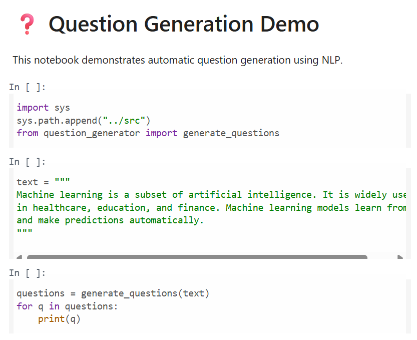

 StudentAI-Assistant
ML-powered study assistant for college students
 📘 StudyBuddy-AI

An ML-powered study assistant built to help college students learn faster,
revise smarter, and prepare better for exams.

⭐ If this project helps you, please consider giving it a star!

---

 🚀 Problem
College students often struggle with:
- Long, unstructured study notes
- Lack of practice questions
- Poor exam-time planning

---

 💡 Solution
StudyBuddy-AI uses Machine Learning and NLP techniques to:
- Summarize lengthy notes
- Generate exam-oriented questions
- Assist in smart study planning

---

 🧠 Features
- 📄 Text Summarization using NLP
- ❓ Automatic Question Generation
- 🗂 Topic-wise study assistance
- ⏱ Smart study planning logic

---

 🛠 Tech Stack
- Python
- Scikit-learn
- NLTK
- Jupyter Notebook

---

 📸 Demo

### Question Generation

---

 🧪 How to Run
1. Clone the repo  
   `git clone https://github.com/your-username/StudyBuddy-AI.git`
2. Install requirements  
   `pip install -r requirements.txt`
3. Run notebooks from `notebooks/`

---

 🌱 Future Scope
- PDF & DOC support
- Personalized learning paths
- Web interface

---

⭐ Star this repo if you find it useful — it motivates student developers!
